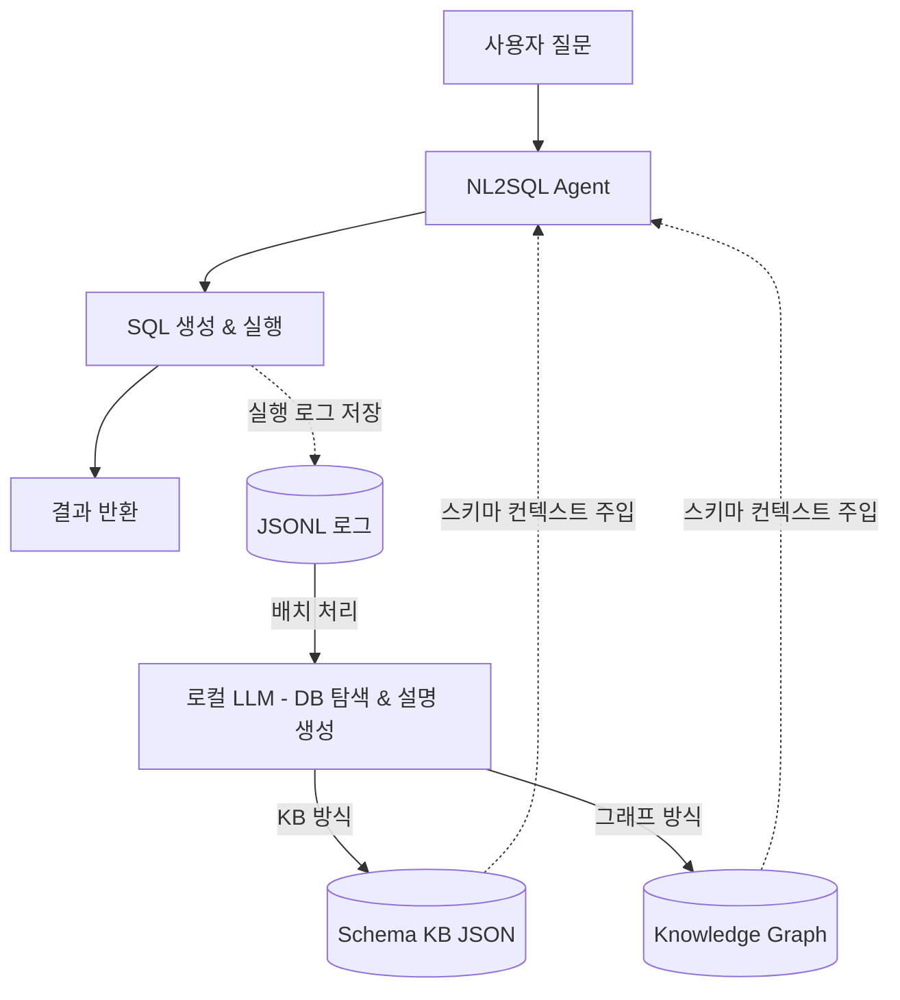

# NL2SQL 스키마 지식 자동 구축 파이프라인

## 흐름 요약

| 단계 | 설명 |
|------|------|
| **실시간** | 질문 → SQL 생성·실행 → 로그 저장 |
| **배치** | 로그 분석 → 컬럼 선별 → 로컬 LLM이 DB 탐색하여 설명 생성 |
| **주입** | 구축된 지식을 고정 메타데이터와 병합하여 다음 SQL 생성 시 활용 |

> KB 방식과 그래프 방식은 배치 단계의 저장 구조만 다르며, 나머지 파이프라인은 동일하다.
