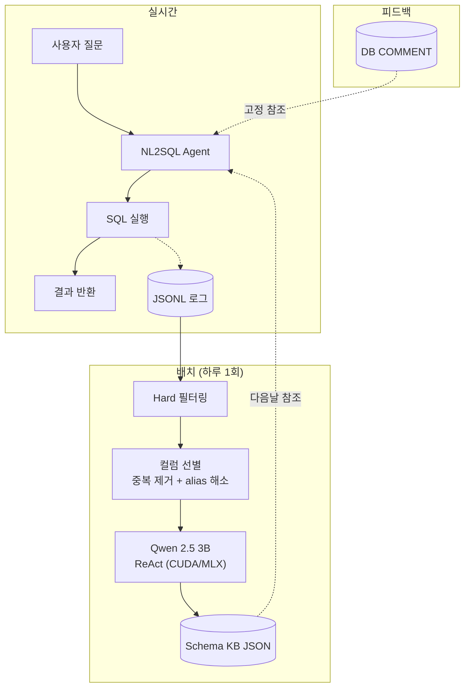

# NL2SQL 피드백 루프 아키텍처

> **목적:** 사용자 질문 → SQL 생성 → 로그 수집 → Schema Enricher (LLM) → KB 증강 → 성능 향상
> **최종 수정:** 2026-06-12

---

## 1. 전체 플로우

```
실시간 (사용자 요청 시)
  사용자 질문
    → NL2SQL Agent (DB COMMENT + Schema KB 참조)
    → SQL 생성 & 실행
    → 결과 반환 + JSONL 로그 저장

배치 (하루 1회)
  하루치 로그
    → Hard 쿼리 필터링
    → 컬럼 참조 분석 (중복 제거, alias 해소)
    → Qwen 2.5 3B ReAct 탐색 (CUDA GPU / MLX)
    → Schema KB 업데이트 (버저닝)
```



---

## 2. Schema Enricher 상세

### Pipeline

```
         ┌──────────────┐
로그 ──▶ │ HardQueryFilter │ ──▶ Hard + 실행에러
         └──────────────┘
                      ▼
         ┌──────────────┐
         │ ColumnSelector │ ──▶ Top-N 컬럼 (min_score 필터)
         │  - SQL 파싱   │      alias 해소 / 따옴표 지원
         │  - 중복 제거  │      동일 (질문, SQL) 1회만 카운트
         └──────────────┘
                      ▼
         ┌──────────────┐
         │ DBExplorerAgent│ ──▶ 컬럼별 설명
         │  (Qwen 2.5 3B)│      ReAct 루프 + fallback
         └──────────────┘
                      ▼
         ┌──────────────┐
         │ SchemaKBUpdater│ ──▶ schema_kb.json
         │  - 버저닝     │      (버전 히스토리 보존)
         └──────────────┘
```

### Step 1: HardQueryFilter

`difficulty = "hard"` + 실행에러 난 쿼리 포함

```
전체 로그 ──▶ 난이도 = "hard" 또는 실행 에러? ──▶ yes → Hard 로그
                                               ──▶ no  → Skip
```

### Step 2-3: ColumnSelector

**SQL 파싱 개선 사항:**
- `FROM table alias` / `JOIN table AS alias` 자동 해소 (`o.status` → `orders.status`)
- 따옴표 식별자 지원 (`"table"."column"`, `` `table`.`column` ``)
- 중복 제거: 동일한 (NL 질문, SQL) 쌍은 1번만 카운트

**스코어 산정:**
| 조건 | 계산 |
|------|------|
| KB 설명 >= 30자 | `score = ref_count × 1.0` |
| KB 설명 < 30자 (빈약) | `score = ref_count × 1.5` |
| `score < min_score` (기본 1.5) | 선별 제외 |

### Step 4: DBExplorerAgent (ReAct + Qwen 2.5 3B)

Qwen 2.5 3B가 ReAct 루프로 DB를 직접 탐색하며 설명을 생성한다.

**ReAct 루프:**
```
Turn 1: ACT:  SELECT DISTINCT orders.status FROM orders;
         OBSERVE: ['processing', 'cancelled', 'completed', ...]

Turn 2: OUTPUT: 이 컬럼은 주문의 상태를 나타내며, ...
```

**Fallback:** `max_turns` 초과 시 마지막 LLM 응답을 설명으로 사용

**모델 사양:**
| 항목 | 값 |
|------|------|
| 모델 | Qwen 2.5 3B Instruct (4bit) |
| 추론 엔진 | CUDA (NVIDIA GPU) 또는 MLX (Apple Silicon) |
| 메모리 | ~1.8GB |
| 생성 속도 | ~66 tok/s |

### Step 5: SchemaKBUpdater

`SchemaKBStore`를 상속하며, 읽기·병합 로직은 `schema/kb_store.py`와 공유한다.
모든 설명은 버저닝되어 JSON에 저장된다.

```json
{
  "orders.status": {
    "table": "orders",
    "column": "status",
    "current_description": "이 컬럼은 주문의 상태를 나타내며, ...",
    "history": [
      { "description": "텍스트형. 고유값: 5개...", "version": 1, ... },
      { "description": "주문의 상태를 나타내는 컬럼...", "version": 2, ... }
    ]
  }
}
```

- 신규: version 1 생성
- 기존: history에 추가 + current 업데이트 (version +1)
- DB COMMENT는 변경하지 않음

---

## 3. 설정

```yaml
# configs/dataset/enricher_config.yaml

model:
  backend: "cuda"
  path: "Qwen/Qwen2.5-3B-Instruct"
  load_in_4bit: true

explorer:
  max_turns: 5
  max_tokens: 256
  temperature: 0.3
  top_p: 0.9

selector:
  top_n: 10
  min_score: 1.5
  dedup_logs: true
  weak_description_threshold: 30
  weak_description_bonus: 0.5

paths:
  kb: "data/schema/ecommerce_kb.json"
  db: "data/samples/ecommerce.sqlite"
  logs: "data/samples/nl2sql_logs.jsonl"
```

---

## 4. 실행

```bash
source .venv/bin/activate
cd NL2SQL_1JO
python3 scripts/run_enricher.py
```

출력 예시:
```
Schema Enricher Pipeline — LLM 모드
모델 : mlx-community/Qwen2.5-3B-Instruct-4bit

[1/5] 로그 로드...          총 20개 로그
[2/5] Hard 쿼리 필터링...   Hard + 실행에러: 11개
[3/5] 보강 대상 선별...      10개 컬럼 선별
[4/5] KB 로드...
[5/5] LLM 탐색 + KB 업데이트...
  ── orders.status (ref=6) ──
     ✅ 설명: 이 컬럼은 주문의 상태를 나타내며, ...
```

---

## 5. Agent가 참조하는 두 소스

| 소스 | 내용 | 신뢰도 | 변경 주기 | 연동 상태 |
|------|------|--------|----------|-----------|
| **DB COMMENT** | CSV `database_description` / DB 메타 | 높음 (고정) | 수동만 | ✅ |
| **Schema KB** | 버저닝된 컬럼 설명 JSON | 중간 | 매일 배치 | ✅ |

Agent는 `DBSearchTool.build_schema_context()`에서 두 소스를 병합한다.
KB는 `supplement` 모드로 `enriched_note (vN, 날짜): ...` 형태로 추가된다.
상세: [schema_kb_integration.md](./schema_kb_integration.md)

---

## 6. 파일 구조

```
NL2SQL_1JO/
├── configs/dataset/
│   ├── enricher_config.yaml                 ← Enricher 설정
│   └── agent_config.yaml                    ← Agent KB 연동 설정
├── data/
│   ├── samples/ecommerce.sqlite             ← DB
│   ├── samples/nl2sql_logs.jsonl            ← 로그
│   └── schema/ecommerce_kb.json             ← KB (출력)
├── scripts/run_enricher.py                  ← Enricher 실행
├── src/nl2sql_agent/
│   ├── schema/
│   │   └── kb_store.py                      ← KB 공유 모듈 (읽기·병합)
│   ├── schema_enricher/
│   │   ├── kb_updater.py                    ← KB 저장 (SchemaKBStore 상속)
│   │   └── ...
│   └── generate_sql/
│       └── db_search_tool.py                ← KB → schema_context 주입
├── tests/test_kb_store.py                   ← KB 단위 테스트
└── docs/
    ├── nl2sql_feedback_flow.md              ← 본 문서
    ├── schema_enricher_setup.md             ← Enricher 셋업 가이드
    └── schema_kb_integration.md             ← KB → SQL 생성 연동
```

---

## 7. 설계 원칙

1. **DB COMMENT는 고정** — 자동 업데이트 금지. 사람만 수동 변경
2. **KB는 자동 갱신** — 매일 배치, 버저닝으로 안전 관리
3. **LLM은 로컬에서** — API 비용 0, 1회 다운로드로 재사용
4. **Hard 쿼리만 집중** — 개선 여지가 큰 Hard에 리소스 집중
5. **버저닝으로 회복성** — LLM이 틀려도 이전 버전으로 롤백 가능

---

## 8. SQL 생성 시 KB 주입 (구현 완료)

```
질문
  → DBSearchTool.search_schema()     ← KB 설명으로 테이블 검색 보강
  → DBSearchTool.build_schema_context()
       ├── SQLite PRAGMA + CSV 설명
       └── SchemaKBStore → enriched_note (vN, 날짜)
  → SQLWritingTool.write_sql(schema_context)
  → trace.kb_hits 기록
```

**컨텍스트 예시:**

```
  - status TEXT [NOT_NULL] | (CSV 설명)
    enriched_note (v3, 2026-06-03): 환불·취소·처리 중 등 여러 상태가 존재합니다.
```

**실행 예시 (ecommerce 샘플):**

```bash
python3 src/nl2sql_agent/run_generate_sql.py \
  --database-root data/samples \
  --db-id ecommerce \
  --question "환불된 주문이 몇 건인지 알려줘" \
  --no-execute
```

상세 설정·CLI·ablation 방법: [schema_kb_integration.md](./schema_kb_integration.md)
