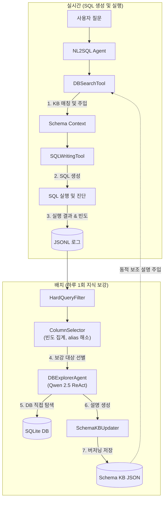

# Schema KB 피드백 및 검색 플로우 아키텍처 정리

이 문서는 `sm_dev` 브랜치를 기준으로 작성된 **SQL 실행 이후의 지식 업데이트(Schema KB) 및 검색/컨텍스트 주입 플로우**의 기능 요약 및 구조도입니다.

---

## 1. 전체 아키텍처 개요

본 시스템은 생성된 SQL의 실행 결과(성공/실패/데이터 유무) 및 로그 분석을 바탕으로 데이터베이스 스키마 지식을 지속적으로 보강(Enrich)하고, 이를 다시 다음 SQL 생성 과정의 검색 및 컨텍스트 제공에 환류하는 **피드백 루프 아키텍처**를 가지고 있습니다.



---

## 2. 주요 모듈 및 역할

### ① SQL 실행 진단 및 실시간 피드백
- **파일**: [diagnosis.py](file:///Users/san/san_code/NL2SQL_1JO/src/nl2sql_agent/schema/diagnosis.py), [schema_kb.py](file:///Users/san/san_code/NL2SQL_1JO/src/nl2sql_agent/schema/schema_kb.py)
- **주요 기능**:
  - **3분류 오류 진단 (`diagnose_failure`)**: 생성된 SQL이 실행에 실패하거나 결과가 없을 때(0 rows), LLM을 사용하여 오류 원인을 아래 3가지 카테고리로 분류합니다.
    - `syntax`: SQL 구문 오류 또는 존재하지 않는 테이블/컬럼 참조.
    - `type`: 컬럼 타입이나 포맷에 맞지 않는 함수/비교 연산 적용.
    - `data`: 쿼리는 정상이나 과도하게 엄격한 필터/조인 등으로 인해 빈 결과 반환 (Wrong literal, Case mismatch 등).
  - **임시 지식베이스 (`SchemaKnowledgeBase`)**: 진단 결과를 바탕으로 특정 테이블에 대한 주의사항 가이드라인(Imperative hint, 30자 이내)을 In-Memory 상에 유지(최대 8개)하여 후속 프롬프트 생성 시 테이블 단위 힌트로 실시간 주입합니다.

### ② 로그 수집 및 보강 대상 선별
- **파일**: [log_filter.py](file:///Users/san/san_code/NL2SQL_1JO/src/nl2sql_agent/schema_enricher/log_filter.py), [column_selector.py](file:///Users/san/san_code/NL2SQL_1JO/src/nl2sql_agent/schema_enricher/column_selector.py)
- **주요 기능**:
  - **오류/Hard 쿼리 필터링 (`HardQueryFilter`)**: 난이도가 `hard`이거나 실행 에러가 발생했던 로그들만 필터링하여 지식 보강 리소스를 집중시킵니다.
  - **정밀 SQL 파싱 및 alias 해소**: SQL 내의 테이블/컬럼 참조 빈도를 계산할 때, 테이블 별칭(`FROM orders o` -> `o.status`를 `orders.status`로 변환)과 따옴표 식별자(`"table"."column"`)를 분석해 정확하게 카운팅합니다.
  - **가중 스코어링 및 선별**: 단순히 사용 빈도만 보는 것이 아니라, **기존 KB 설명이 빈약하거나 없는 컬럼**에 가산점을 부여(`score = ref_count * 1.5`)하여 보강이 시급한 컬럼을 우선적으로 선별합니다.

### ③ LLM DBExplorer (ReAct 루프)
- **파일**: [db_explorer.py](file:///Users/san/san_code/NL2SQL_1JO/src/nl2sql_agent/schema_enricher/db_explorer.py), [llm_caller.py](file:///Users/san/san_code/NL2SQL_1JO/src/nl2sql_agent/schema_enricher/llm_caller.py)
- **주요 기능**:
  - **ReAct 탐색 기법**: `Qwen 2.5 3B` 로컬 LLM이 ReAct(Reason-Act-Observe) 루프 내에서 읽기 전용 `SELECT` 쿼리를 스스로 생성 및 실행하고 결과값을 관찰하며 컬럼의 비즈니스적 의미와 실제 데이터 포맷을 학습합니다.
  - **다중 엔진/백엔드 지원 (`llm_caller.py`)**:
    - **Mac(Apple Silicon)**: Apple Silicon 최적화 프레임워크인 `mlx` 백엔드를 사용하여 고속(4-bit 양자화 모델) 로컬 추론을 제공합니다.
    - **CUDA GPU**: Linux/Windows 환경을 위해 PyTorch `transformers` 기반의 `bitsandbytes` 4-bit 양자화 추론을 지원합니다.
    - `backend="auto"` 옵션으로 로컬 실행 환경에 맞춰 자동 분기 처리됩니다.

### ④ KB 저장소 관리 및 버저닝
- **파일**: [kb_store.py](file:///Users/san/san_code/NL2SQL_1JO/src/nl2sql_agent/schema/kb_store.py), [kb_updater.py](file:///Users/san/san_code/NL2SQL_1JO/src/nl2sql_agent/schema_enricher/kb_updater.py)
- **주요 기능**:
  - **데이터 모델**: KB에 추가되는 모든 설명은 테이블명, 컬럼명, 최종 설명 외에도 이전 버전들의 기록(`history`)을 `DescriptionVersion` 리스트 객체로 보관합니다.
  - **버저닝 기법**: 새로운 설명이 추가될 때 기존 버전을 삭제하지 않고 히스토리에 누적하여 버전 번호와 수정 시각을 갱신합니다. 이를 통해 LLM 탐색 오류 발생 시 안전하게 롤백할 수 있는 회복성을 확보합니다.
  - **구조적 보존**: 기존 데이터베이스의 기본 주석(`DB COMMENT`)이나 메타데이터 파일은 절대 건드리지 않고, 별도의 `{db_id}_kb.json` 파일에 저장하여 고정 지식과 동적 지식을 분리 관리합니다.

### ⑤ 스키마 검색 및 컨텍스트 연동
- **파일**: [db_search_tool.py](file:///Users/san/san_code/NL2SQL_1JO/src/nl2sql_agent/generate_sql/db_search_tool.py)
- **주요 기능**:
  - **검색 기능 보강 (`search_schema`)**: 사용자의 자연어 질문과 스키마를 매칭할 때, 기존 컬럼명/타입 외에도 **동적으로 축적된 KB 설명 내 단어(예: "환불", "취소")까지 검색 대상 토큰에 포함**하여 테이블 선별 성공률을 향상시킵니다.
  - **컨텍스트 병합 (`merge_mode: "supplement"`)**:
    기존 DB COMMENT를 첫 줄에 유지하면서, KB에 누적된 지식을 `enriched_note` 형식으로 덧붙여 LLM 프롬프트에 주입합니다.
    *출력 예시:*
    ```
    - status TEXT [NOT_NULL] | Order lifecycle state
      enriched_note (v3, 2026-06-12): 환불, 취소, 처리 중 등의 상태가 존재하며 값으로는 'cancelled', 'refunded'가 주로 사용됩니다.
    ```
  - **추적 및 평가 (`last_kb_hits`)**: 스키마 컨텍스트 빌드 시 어떤 컬럼의 KB 지식이 프롬프트에 활용되었는지 추적하여 평가(Ablation Study) 및 디버깅을 지원합니다.

---

## 3. 핵심 설정 (`agent_config.yaml` / `enricher_config.yaml`)

### Agent 측 설정 (`configs/dataset/agent_config.yaml`)
```yaml
schema_kb:
  enabled: true                                  # KB 연동 여부
  path_template: "data/schema/{db_id}_kb.json"   # DB ID별 자동 매칭 템플릿
  merge_mode: "supplement"                       # 기본 메타데이터 유지 + 보조 라인 추가
  include_in_search: true                        # search_schema 점수에 KB 텍스트 반영
```

### 배치 Enricher 측 설정 (`configs/dataset/enricher_config.yaml`)
```yaml
model:
  backend: "auto"                                # auto (Mac: mlx, GPU 서버: cuda)
  path: "Qwen/Qwen2.5-3B-Instruct"               # 기본 추론 모델
  load_in_4bit: true                             # 4bit 양자화로 VRAM 절약

selector:
  top_n: 10                                      # 하루에 보강할 최대 컬럼 수
  min_score: 1.5                                 # 1회 참조 등 가치가 낮은 경우 제외
  weak_description_threshold: 30                 # 30자 이하인 경우 설명 빈약으로 간주
  weak_description_bonus: 0.5                    # 설명이 빈약한 컬럼에 50%의 가중 스코어 보너스
```

---

## 4. 데이터베이스 및 지식베이스 비교 요약

| 지식 종류 | 소스 | 갱신 주기 | 신뢰도 | 수정 방식 |
| :--- | :--- | :--- | :--- | :--- |
| **고정 메타데이터** | DB Schema, CSV 설명 | 변경 없음 | 매우 높음 | 개발자 수동 관리 |
| **동적 지식베이스** | `{db_id}_kb.json` | 매일 배치 (Enricher) | 중간-높음 | LLM ReAct 자동 업데이트 (버저닝) |
| **실시간 힌트** | `SchemaKnowledgeBase` (In-Memory) | 실시간 (SQL 실행 실패 시) | 가변적 | 오류 진단 LLM이 자동 기록 |
