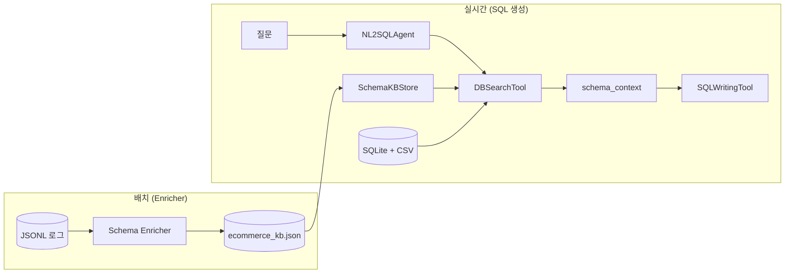

# Schema KB → SQL 생성 연동

> Enricher가 생성한 JSON KB를 NL2SQL Agent가 SQL 생성 시 참조하는 방법
> **최종 수정:** 2026-06-12

---

## 1. 개요

Schema Enricher가 `data/schema/{db_id}_kb.json`에 쌓은 컬럼 설명을, SQL 생성 단계에서 **스키마 컨텍스트**로 주입한다.

| 구분 | 역할 |
|------|------|
| **SchemaKBStore** (`schema/kb_store.py`) | JSON KB 읽기·병합 (Agent 측) |
| **SchemaKBUpdater** (`schema_enricher/kb_updater.py`) | JSON KB 쓰기·버저닝 (Enricher 측) |
| **DBSearchTool** (`generate_sql/db_search_tool.py`) | 스키마 검색 + 컨텍스트 포맷 시 KB 주입 |

Enricher와 Agent는 `kb_store.py`의 모델·로드·병합 로직을 공유한다.

---

## 2. 데이터 흐름



---

## 3. 병합 규칙 (`merge_mode: supplement`)

DB COMMENT / CSV 설명은 **그대로 유지**하고, KB 설명은 **보조 라인**으로 추가한다.

```
  - status TEXT [NOT_NULL] | Order lifecycle state
    enriched_note (v3, 2026-06-03): 환불·취소·처리 중 등. 값 예: cancelled, refunded
```

| 항목 | 설명 |
|------|------|
| 첫 줄 `|` 뒤 | DB/CSV 기본 설명 (신뢰도 높음) |
| `enriched_note (vN, 날짜)` | Enricher KB 설명 + 버전·갱신일 |
| KB 없음 | 기존과 동일하게 DB/CSV 설명만 표시 |

---

## 4. 연동 지점 (`DBSearchTool`)

### 4-1. `search_schema()` — 관련 테이블 검색

질문 토큰과 매칭할 때 KB 설명 텍스트도 점수에 포함한다.
"환불"처럼 컬럼명에 없는 비즈니스 용어가 KB에 있으면 해당 테이블 선별 확률이 올라간다.

### 4-2. `_format_schema_context()` — LLM 컨텍스트

선별된 테이블·컬럼에 대해서만 KB를 조회해 `enriched_note` 라인을 추가한다.
전체 KB를 프롬프트에 넣지 않는다.

### 4-3. `last_kb_hits` — 추적

`build_schema_context()` 호출 후 `orders.status` 형태의 KB 키 목록을 반환한다.
Agent trace의 `kb_hits` 필드에 기록되어 ablation·디버깅에 활용한다.

---

## 5. 설정

### Agent 설정 (`configs/dataset/agent_config.yaml`)

```yaml
schema_kb:
  enabled: true
  path_template: "data/schema/{db_id}_kb.json"   # db_id=ecommerce → ecommerce_kb.json
  merge_mode: "supplement"
  include_in_search: true
```

| 옵션 | 기본값 | 설명 |
|------|--------|------|
| `enabled` | `true` | KB 비활성화 시 기존 동작(CSV+SQLite만) |
| `path` | — | 명시 경로 (선택). `path`보다 `path_template` 우선순위는 파일 존재 여부로 결정 |
| `path_template` | `data/schema/{db_id}_kb.json` | db_id별 KB 파일 탐색 |
| `merge_mode` | `supplement` | DB 설명 유지 + KB 보조 추가 |
| `include_in_search` | `true` | `search_schema` 점수에 KB 반영 |

KB 파일이 없으면 자동 skip (BIRD/Spider 등 KB 미구축 DB 호환).

### CLI (`run_generate_sql.py`)

```bash
# 기본: path_template으로 KB 자동 탐색
python3 src/nl2sql_agent/run_generate_sql.py \
  --database-root data/samples \
  --db-id ecommerce \
  --question "환불된 주문이 몇 건인지 알려줘"

# KB 경로 명시
python3 src/nl2sql_agent/run_generate_sql.py \
  --schema-kb data/schema/ecommerce_kb.json \
  ...

# ablation: KB 없이 실행
python3 src/nl2sql_agent/run_generate_sql.py \
  --no-schema-kb \
  ...
```

---

## 6. 공유 모듈 구조

```
src/nl2sql_agent/schema/
├── kb_store.py          ← ColumnKBEntry, SchemaKBStore, merge_column_descriptions
├── schema_kb.py         ← 실행 피드백 In-Memory KB (별도 모듈)
└── diagnosis.py         ← 실행 실패 진단

src/nl2sql_agent/schema_enricher/
└── kb_updater.py        ← SchemaKBStore 상속, update()/save()
```

`SchemaKBUpdater`는 `SchemaKBStore`를 상속해 읽기 로직을 재사용하고, `update()`·`save()`만 추가한다.

---

## 7. 피드백 루프 (현재 상태)

| 단계 | 상태 |
|------|------|
| Enricher → KB JSON 저장 | ✅ 구현 |
| Agent → KB JSON 읽기 | ✅ 구현 |
| Agent → JSONL 로그 저장 | ⬜ 미구현 (다음 단계) |

전체 피드백 루프를 닫으려면 Agent 실행 결과를 `nl2sql_logs.jsonl` 형식으로 저장하는 로거가 추가로 필요하다.

---

## 8. 관련 문서

- [nl2sql_feedback_flow.md](./nl2sql_feedback_flow.md) — 전체 피드백 아키텍처
- [schema_enricher_setup.md](./schema_enricher_setup.md) — Enricher 셋업·실행
